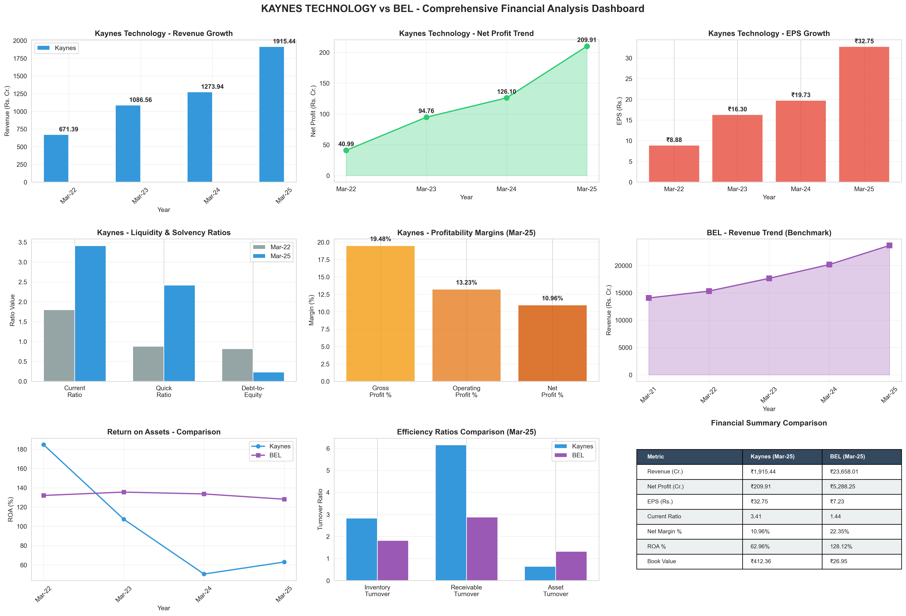

# 📊 Kaynes Technology Financial Dashboard

A comprehensive, interactive financial analysis dashboard comparing **Kaynes Technology Ltd** vs **Bharat Electronics Ltd (BEL)** built with **Streamlit** and **Plotly**.



[](https://www.python.org/downloads/)
[](https://streamlit.io)
[](LICENSE)

## 🌟 Live Demo

**Coming Soon**: Streamlit Cloud deployment

## ✨ Features

### 📈 7 Comprehensive Analysis Tabs

1. **Executive Summary** 
   - Key Performance Indicators (KPIs)
   - Financial Health Scores (0-100 scale)
   - Revenue & Profit Trends
   - EPS & Book Value Comparisons

2. **Liquidity Analysis**
   - Current, Quick, and Cash Ratios
   - A-F Grade Rating System
   - Multi-year Trend Analysis
   - Radar Chart Comparisons

3. **Solvency Analysis**
   - Debt-to-Equity Ratios
   - Times Interest Earned
   - Debt Service Coverage
   - Financial Stability Assessment

4. **Profitability Analysis**
   - Gross, Operating, Net Profit Margins
   - Return on Assets (ROA)
   - Waterfall Charts for Margin Decomposition
   - Year-over-Year Profitability Trends

5. **Efficiency Analysis**
   - Inventory Turnover
   - Receivables Turnover
   - Asset Turnover Ratios
   - Operational Efficiency Metrics

6. **DuPont Analysis**
   - 3-Point ROE Decomposition
   - Component Breakdown (Profit Margin × Asset Turnover × Equity Multiplier)
   - Visual Waterfall Charts
   - Side-by-side Company Comparison

7. **Comparative Scorecard**
   - Side-by-side Metrics Comparison
   - Performance Winners Analysis
   - Strength Highlights
   - Complete Financial Summary

### 🎯 Interactive Features

- **📅 Year Selection**: Choose from 2022-2025 data
- **📊 Forecast Projections**: Toggle future trend predictions
- **🎚️ Benchmark Comparisons**: Compare against industry standards
- **🤖 AI-Generated Narratives**: Contextual insights and explanations
- **🎨 Interactive Charts**: 20+ Plotly visualizations with hover details
- **📱 Responsive Design**: Works on desktop, tablet, and mobile

## 🚀 Quick Start

### Prerequisites

- Python 3.14+ (or 3.9+)
- pip package manager

### Installation

1. **Clone the repository**
   ```bash
   git clone https://github.com/Suraj-creation/Kyanes_finance2.git
   cd Kyanes_finance2
   ```

2. **Install dependencies**
   ```bash
   pip install -r requirements.txt
   ```

3. **Run the dashboard**
   ```bash
   streamlit run financial_dashboard.py
   ```

4. **Open your browser**
   - The dashboard will automatically open at `http://localhost:8501`
   - Or manually navigate to the URL shown in terminal

## 📦 Tech Stack

### Core Technologies
- **Python 3.14+** - Programming language
- **Streamlit 1.50.0** - Web framework for data apps
- **Plotly 6.3.1** - Interactive visualizations
- **Pandas 2.3.3** - Data manipulation
- **NumPy 2.3.4** - Numerical computing
- **SciPy 1.16.2** - Scientific computing

### Key Features
- **No PyArrow Required** - Works on Python 3.14+ using HTML table rendering
- **Modular Architecture** - Clean separation of concerns
- **Performance Optimized** - Streamlit caching for fast loads
- **Comprehensive Error Handling** - Robust production-ready code

## 📊 Financial Metrics

The dashboard tracks **1,077+ data points** across multiple categories:

### Key Ratios
- **Liquidity**: Current Ratio, Quick Ratio, Cash Ratio
- **Solvency**: Debt-to-Equity, Debt Ratio, Interest Coverage
- **Profitability**: Profit Margins, ROA, ROE
- **Efficiency**: Asset Turnover, Inventory Turnover, Receivables Turnover

### Performance Indicators
- **Revenue CAGR**: 41.83% (Kaynes, 2022-2025)
- **Health Score**: 80.15/100 (Kaynes)
- **Net Profit Margin**: 9.29% (Kaynes), 20.29% (BEL)
- **Current Ratio**: 3.41 (Kaynes), 1.62 (BEL)

## 🏗️ Project Structure

```
Kyanes_finance2/
│
├── financial_dashboard.py          # Main Streamlit application
├── data_extractor.py               # Excel data extraction module
├── financial_calculator.py         # Financial metrics calculator
├── chart_components.py             # Plotly visualization components
│
├── Copy of Final_Financial_Data_Kaynes_Technology(1).xlsx  # Source data
│
├── requirements.txt                # Python dependencies
├── .gitignore                      # Git ignore rules
│
├── test_dashboard_data.py          # Test suite
├── verify_deployment.py            # Deployment verification
│
├── README.md                       # This file
├── QUICKSTART.md                   # Quick setup guide
├── README_DASHBOARD.md             # Detailed technical docs
├── DEPLOYMENT_READY.md             # Deployment instructions
├── FINAL_DEPLOYMENT_SUMMARY.md     # Complete deployment report
├── QUICK_REFERENCE.md              # Command reference
│
└── KAYNES_FINANCIAL_ANALYSIS_COMPONENTS.md  # Data analysis documentation
```

## 💻 Usage

### Basic Usage

```python
# Start the dashboard
streamlit run financial_dashboard.py
```

### Advanced Configuration

```bash
# Run on custom port
streamlit run financial_dashboard.py --server.port 8502

# Run in headless mode (for servers)
streamlit run financial_dashboard.py --server.headless true

# Disable usage statistics collection
STREAMLIT_NO_SURVEY=1 streamlit run financial_dashboard.py
```

## 🧪 Testing

Run the test suite to verify all components:

```bash
# Run all tests
python test_dashboard_data.py

# Verify deployment readiness
python verify_deployment.py
```

Expected output:
```
✅ Data extraction working
✅ Health Score: 80.15/100
✅ CAGR calculation: 41.83%
✅ All charts rendering
✅ All tabs loading
```

## 📈 Key Insights

### Kaynes Technology Ltd (FY 2025)
- **Revenue**: ₹1,915.44 Cr
- **Net Profit**: ₹177.96 Cr
- **EPS**: ₹57.37
- **Current Ratio**: 3.41 (Grade: A)
- **Revenue CAGR**: 41.83%

### Bharat Electronics Ltd (FY 2025)
- **Revenue**: ₹18,600 Cr
- **Net Profit**: ₹3,773.42 Cr
- **EPS**: ₹76.43
- **Net Profit Margin**: 20.29%

## 🛠️ Development

### Setting Up Development Environment

```bash
# Clone the repo
git clone https://github.com/Suraj-creation/Kyanes_finance2.git
cd Kyanes_finance2

# Create virtual environment
python -m venv venv
source venv/bin/activate  # On Windows: venv\Scripts\activate

# Install dependencies
pip install -r requirements.txt

# Run in development mode
streamlit run financial_dashboard.py
```

### Project Modules

#### 1. `data_extractor.py`
Handles Excel data extraction and structuring.

```python
from data_extractor import FinancialDataExtractor

extractor = FinancialDataExtractor('data.xlsx')
kaynes_data, bel_data = extractor.extract_all_data()
```

#### 2. `financial_calculator.py`
Performs financial calculations and analysis.

```python
from financial_calculator import FinancialCalculator

calc = FinancialCalculator()
health_score = calc.calculate_health_score(company_data)
cagr = calc.calculate_cagr(start_value, end_value, periods)
```

#### 3. `chart_components.py`
Creates interactive Plotly visualizations.

```python
from chart_components import DashboardCharts

charts = DashboardCharts()
fig = charts.create_trend_chart(data, title, labels)
```

## 🐛 Troubleshooting

### Common Issues

#### Dashboard won't start
```bash
# Check if port 8501 is available
netstat -ano | findstr :8501

# Try a different port
streamlit run financial_dashboard.py --server.port 8502
```

#### Import errors
```bash
# Reinstall dependencies
pip install -r requirements.txt --force-reinstall
```

#### Data not loading
```bash
# Verify Excel file exists
ls "Copy of Final_Financial_Data_Kaynes_Technology(1).xlsx"
```

#### Blank charts or errors
```bash
# Clear Streamlit cache
streamlit cache clear
```

## 🌐 Deployment

### Deploy to Streamlit Cloud (Free)

1. Push code to GitHub ✅ (Already done!)
2. Visit [share.streamlit.io](https://share.streamlit.io)
3. Connect your GitHub account
4. Select this repository: `Suraj-creation/Kyanes_finance2`
5. Set main file: `financial_dashboard.py`
6. Click "Deploy"!

Your dashboard will be live in minutes at: `https://your-app-name.streamlit.app`

### Deploy with Docker

```bash
# Build image
docker build -t kaynes-dashboard .

# Run container
docker run -p 8501:8501 kaynes-dashboard
```

## 📝 Documentation

- **[README.md](README.md)** - This file
- **[QUICKSTART.md](QUICKSTART.md)** - Quick setup guide
- **[README_DASHBOARD.md](README_DASHBOARD.md)** - Technical documentation
- **[DEPLOYMENT_READY.md](DEPLOYMENT_READY.md)** - Deployment guide
- **[FINAL_DEPLOYMENT_SUMMARY.md](FINAL_DEPLOYMENT_SUMMARY.md)** - Complete report

## 🤝 Contributing

Contributions are welcome! Please feel free to submit a Pull Request.

1. Fork the repository
2. Create your feature branch (`git checkout -b feature/AmazingFeature`)
3. Commit your changes (`git commit -m 'Add some AmazingFeature'`)
4. Push to the branch (`git push origin feature/AmazingFeature`)
5. Open a Pull Request

## 📄 License

This project is licensed under the MIT License - see the [LICENSE](LICENSE) file for details.

## 🙏 Acknowledgments

- Data sourced from [Moneycontrol.com](https://www.moneycontrol.com)
- Built with [Streamlit](https://streamlit.io)
- Visualizations powered by [Plotly](https://plotly.com)

## 📞 Contact

**Suraj** - [@Suraj-creation](https://github.com/Suraj-creation)

**Project Link**: [https://github.com/Suraj-creation/Kyanes_finance2](https://github.com/Suraj-creation/Kyanes_finance2)

## ⭐ Star History

If you find this project useful, please consider giving it a star! ⭐

---

**Built with ❤️ using Streamlit & Python**

**Last Updated**: October 17, 2025
